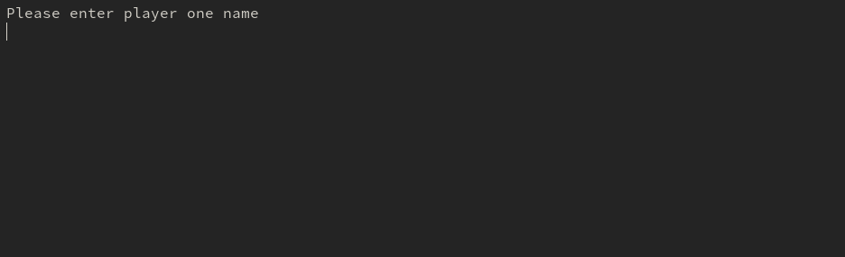

# TICTACTOE GAME



> Tic-tac-toe (also known as noughts and crosses or Xs and Os) is a game for two players, X and O, who take turns marking the spaces in a 3×3 grid. The player who first succeeds in placing three of their marks in a horizontal, vertical, or diagonal row wins the game. When any of the player did not succeed in placing three of their marks in a horizontal, vertical, or diagonal row to win, it becomes a draw game at the end of the posible move.


## How to Install

- Install Ruby
    Please [click here](https://www.ruby-lang.org/en/documentation/installation/) and follow the instruction on how to install ruby
    
- Clone this repository or [download](https://github.com/thankgodr/TicTacToe/archive/development.zip) the zip version

- Open Command prompt for windows users or Terminal for Linux/MacOS users and run the following commad

    ```console
    $ cd TICTACTOE
    $ ./bin/main.rb
    ```
    
## How to Play

- Enter Player one and Player two name when Prompted and hit the enter key on your keyboard
- Select who is playing first by entering 1 or 2 and hit the enter key on your keyboard
- Each player has a turn to select any number showing on the gameboard to place their marks and hit the enter key
- Repeat the last step until there is a winner or a draw.
- You can repeat the game without entering Players Playing again without quiting the game

 ## Note
 - If you have quit the game and want to restart the game locate the game folder your terminal and enter

    ```console
    $ ./bin/main.rb
    ```
    

## Built With

- RUBY

## Authors

👤 **ThankGod Richard**

- Github: [@githubhandle](https://github.com/thankgodr)
- Twitter: [@twitterhandle](https://twitter.com/thankgodrichard)
- Linkedin: [linkedin](https://linkedin.com/in/thankgodr)

👤 **Felipe dos Anjos**

- Github: [@githubhandle](https://github.com/fc-anjos)
- Linkedin: [linkedin](https://www.linkedin.com/in/felipe-cavalheiro-dos-anjos-4792a8176/)

## 🤝 Contributing
Contributions, issues and feature requests are welcome!
Feel free to check the [issues page](issues/).

## Show your support
Give a ⭐️ if you like this project!

## 📝 License
This project is [MIT](lic.url) licensed.
